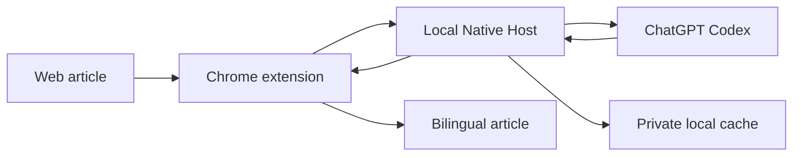

<div align="center">
  
  <h1>Transly</h1>
  <p><strong>High-context article translation for Chrome, powered by your Codex subscription.</strong></p>

  <p>
    <a href="LICENSE"></a>
    
    
    
  </p>

  <p>
    <a href="#why-transly">Why Transly</a> ·
    <a href="#install-transly">Agent Install</a> ·
    <a href="#features">Features</a> ·
    <a href="#transly-vs-immersive-translate">Comparison</a> ·
    <a href="#how-it-works">Architecture</a> ·
    <a href="#credits">Credits</a>
  </p>
</div>

Transly translates long-form web articles as coherent documents, not isolated fragments. It sends each batch with shared article context to Codex, then inserts complete, validated paragraphs as they become ready.

## Why Transly

- **Better long-form coherence.** More shared context helps preserve terminology, tone, and meaning across an article.
- **No separate API bill.** Transly uses your existing Codex login, with no API key or per-token API charge. Codex subscription limits still apply.
- **Built for reading.** Bilingual and translation-only layouts preserve links, code, formulas, and the original page structure.

## Install Transly

### For agents

Paste this into Codex or another coding agent with terminal access:

```text
Install the Transly Chrome extension from https://github.com/1MoreBuild/transly.
Read AGENTS.md first. Use an existing checkout, or ask me where to clone it.
Run npm install, npm run setup, and npm test. Do not run smoke tests or any real
model request without asking me. Load the repository root as an unpacked Chrome
extension if you can control Chrome; otherwise give me its exact path. Report
what succeeded, any manual step left, and whether a model request ran.
```

### For humans

Requires macOS, Chrome 105+, Node.js 20+, and Codex CLI logged in with ChatGPT.

```bash
codex login # only if needed
git clone https://github.com/1MoreBuild/transly.git
cd transly
npm install
npm run setup
```

Then open `chrome://extensions`, enable **Developer mode**, choose **Load unpacked**, and select the `transly` repository root. `setup` installs and verifies the Native Host without sending a model request.

## Features

- Context-aware article batches with natural target-language translation.
- Complete paragraphs stream into the page as they become ready.
- Bilingual and translation-only modes with click-to-reveal originals.
- Links, line breaks, code, formulas, and protected elements stay intact.
- AI coverage audit and a persistent 30-day local response cache.
- **Beta:** video subtitles for YouTube timed text, WebVTT, and Bilibili subtitle JSON.

PDF, EPUB, OCR, image translation, and input-box translation are not supported.

## Transly vs. Immersive Translate

Transly is narrower than [Immersive Translate](https://immersivetranslate.com/). It trades feature breadth for a translation pipeline focused on long articles and larger shared context.

| | Transly | Immersive Translate |
| --- | --- | --- |
| Focus | Context-rich article translation through Codex | Mature, all-in-one translation across formats and platforms |
| Model cost | Uses an existing Codex subscription; no separate API bill | Depends on product tier and selected translation service |
| Scope | Articles; video subtitles in beta | Websites, PDFs, EPUBs, images, subtitles, input boxes, and more |
| Maturity | Early-stage, macOS-only open source | Broad compatibility across desktop and mobile platforms |

Transly is designed for stronger long-form coherence, but this is not yet a published benchmark result.

## How It Works



The extension extracts visible content and protects page structure. A local Native Host owns Codex authentication, request concurrency, caching, diagnostics, and optional tracing. OAuth credentials never enter webpage code or the extension UI.

See [docs/architecture.md](docs/architecture.md) for the full protocol and security boundary.

## Local by Default

- Responses are cached under `~/Library/Caches/Transly/responses/` for 30 days, with private file permissions and a 1,000-entry limit.
- Redacted timing logs live under `~/Library/Logs/Transly/`; they exclude article text, prompts, outputs, and credentials.
- Langfuse is optional and disabled without configuration.

<details>
<summary><strong>Enable Langfuse tracing</strong></summary>

Copy `.env.example` to `.env.local` and set:

```bash
LANGFUSE_SECRET_KEY=...
LANGFUSE_PUBLIC_KEY=...
LANGFUSE_BASE_URL=https://cloud.langfuse.com
```

Tracing sends model prompts and outputs, including translated page text, to your configured Langfuse project. OAuth credentials remain redacted.

</details>

## Development

```bash
npm test                    # No model request
npm run preflight           # Check local requirements
npm run native:doctor       # Verify the Native Host
npm run native:smoke        # One real model request
npm run native:smoke:concurrent
npm run logs -- --limit 80
```

Smoke tests consume Codex subscription capacity. After source changes, reload the extension from `chrome://extensions`.

<details>
<summary><strong>Troubleshooting</strong></summary>

- Native Host disconnected: run `npm run native:doctor`, then `npm run native:install`.
- Repository moved: run `npm run setup` again.
- Model unavailable: set `TRANSLY_CODEX_MODEL` in `.env.local`.
- Chrome load error: select the repository root, not `src/`.

</details>

## Credits

Transly owes a substantial design debt to [Immersive Translate](https://immersivetranslate.com/). Its bilingual reading model, DOM-aware extraction, placeholder protection, style preservation, site compatibility work, and subtitle support informed many of Transly's product and engineering decisions.

Transly is an independent implementation with a narrower focus on Codex-powered article translation. It is not affiliated with or endorsed by Immersive Translate, and proprietary extension source is not included in this repository.

## Status

Transly is an early-stage, macOS-only project. The ChatGPT Codex backend is not a public stable API and may require compatibility updates.

## License

[MIT](LICENSE)
