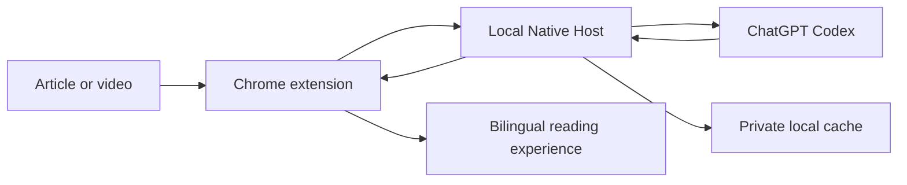

<div align="center">
  
  <h1>Transly</h1>
  <p><strong>Read the web in your language, powered by your Codex subscription.</strong></p>
  <p>Context-aware article and video subtitle translation for Chrome.</p>

  <p>
    <a href="LICENSE"></a>
    
    
    
  </p>

  <p>
    <a href="#why-transly">Why Transly</a> ·
    <a href="#what-it-does">Features</a> ·
    <a href="#quick-start">Quick Start</a> ·
    <a href="#how-it-works">How It Works</a> ·
    <a href="#development">Development</a>
  </p>
</div>

Transly is a local-first Chrome extension for reading articles and watching subtitled videos across languages. It uses your existing ChatGPT Codex login, so there is no API key to configure and no translation server to keep running.

Instead of translating isolated fragments, Transly gives the model coherent article context, translates in practical batches, and displays each completed paragraph as soon as it is ready. The result is designed to read like natural writing, not a sequence of literal sentence conversions.

> [!NOTE]
> Transly is an early, macOS-only open-source project. It currently supports article translation and video subtitles. It is not affiliated with OpenAI or Immersive Translate.

## Why Transly

Browser translators are often designed around metered APIs. They split pages into small requests to reduce token cost, but that can remove the context a model needs to translate meaning, terminology, and tone consistently.

Transly makes a different tradeoff. It assumes translation quality matters more than minimizing every token:

- **More context, fewer guesses.** Every article batch receives shared page context.
- **Natural target-language writing.** The translation prompt favors meaning, tone, and native phrasing over source-language word order.
- **Fast first results.** Completed paragraphs appear progressively while the rest of the article continues in the background.
- **Structure stays intact.** Links, code, formulas, names, and other protected inline content are preserved rather than translated blindly.
- **A second pass catches gaps.** An AI audit checks visible article blocks and repairs content the initial extractor missed.
- **Repeat reads are fast.** Successful translations and audits are cached locally across Native Host restarts.

## What It Does

| Experience | Current support |
| --- | --- |
| Article translation | Context-aware batches for top-level pages and article iframes |
| Reading modes | Bilingual view or translation-only view with click-to-reveal originals |
| Progressive results | Renders complete translated paragraphs as the model returns them |
| Rich content | Preserves links, line breaks, code, formulas, and protected page elements |
| Video subtitles | YouTube timed text, WebVTT, and Bilibili subtitle JSON |
| Local model access | Uses the local Codex ChatGPT authentication flow; no API key in the extension |
| Quality audit | Checks the translated page for missing or broken article blocks |
| Observability | Optional Langfuse tracing for the full translation trajectory |

PDF, EPUB, OCR, image translation, and input-box translation are intentionally outside the current scope.

## Quick Start

### 1. Prepare your machine

You need:

- macOS
- Google Chrome 105 or newer
- Node.js 20 or newer
- Codex CLI logged in with ChatGPT

If needed, authenticate Codex first:

```bash
codex login
```

### 2. Install Transly

```bash
git clone https://github.com/1MoreBuild/transly.git
cd transly
npm install
npm run setup
```

`npm run setup` checks the local requirements, installs the user-level Native Messaging Host, and verifies the connection. It does not send a model request.

### 3. Load the Chrome extension

1. Open `chrome://extensions`.
2. Enable **Developer mode**.
3. Select **Load unpacked**.
4. Choose the cloned `transly` repository folder.

Open an article, click the Transly icon, choose a target language, and select **Translate this article**.

The Native Host starts automatically when Transly needs it. You do not need to run a local server or leave a terminal process open.

## Reading With Transly

Transly supports two article layouts:

- **Bilingual** places the translation below its source paragraph.
- **Translation only** hides the source while keeping it one click away.

Article batches are prioritized around the current viewport. A subtle inline loading state marks pending passages, and each paragraph replaces its loading state only after a complete translation has passed structural validation.

For supported videos, enable **Video subtitles** in the popup to display the translated subtitle overlay alongside the source subtitle.

## How It Works



The Chrome extension extracts visible content and protects page structure. Its MV3 service worker sends validated requests through Chrome Native Messaging. The local Native Host owns Codex authentication, model request concurrency, response caching, diagnostics, and optional Langfuse tracing.

No OAuth credential is exposed to webpage code or the Chrome extension UI.

See [docs/architecture.md](docs/architecture.md) for the protocol, request lifecycle, batching strategy, and security boundary.

## Local Data and Privacy

Successful translation and AI audit responses are cached under:

```text
~/Library/Caches/Transly/responses/
```

Cache files use hashed names, are readable only by the current user, expire after 30 days, and are limited to 1,000 persistent responses. Delete that directory to clear the cache.

Redacted diagnostics are written to `~/Library/Logs/Transly/`. They include timing, request phase, item counts, and sanitized URLs. They do not contain article text, model prompts, model output, or OAuth credentials.

## Optional Langfuse Tracing

Langfuse is disabled by default and is not required for translation.

To enable it, copy `.env.example` to `.env.local` and configure:

```bash
LANGFUSE_SECRET_KEY=...
LANGFUSE_PUBLIC_KEY=...
LANGFUSE_BASE_URL=https://cloud.langfuse.com
```

Langfuse traces include model prompts and outputs so you can inspect the complete translation trajectory. Enabling it therefore sends article or subtitle text to the configured Langfuse project. OAuth credentials are always redacted.

## Development

```bash
npm test                    # Run tests without calling the model
npm run preflight           # Check local requirements
npm run native:doctor       # Verify the Native Host installation
npm run native:smoke        # Send one real translation request
npm run native:smoke:concurrent
npm run logs -- --limit 80  # Inspect recent redacted diagnostics
```

`native:smoke` and `native:smoke:concurrent` consume Codex subscription capacity. Tests, `preflight`, and `native:doctor` do not call the model.

After ordinary JavaScript changes, reload Transly from `chrome://extensions`. After moving the repository or changing the extension key, Native Host manifest, or launcher, run `npm run native:install` again.

## Troubleshooting

**The popup says the Native Host is disconnected**

```bash
npm run native:doctor
npm run native:install
```

Then reload the extension.

**The repository was moved or renamed**

Run `npm run setup` again so the Native Host launcher points to the new path.

**The default model is unavailable**

Set a model available to your Codex account in `.env.local`:

```bash
TRANSLY_CODEX_MODEL=gpt-5.6-luna
```

**Chrome cannot load the extension**

Select the repository root, not `src/`, when using **Load unpacked**.

## Credits

Transly owes a substantial design debt to [Immersive Translate](https://immersivetranslate.com/). Immersive Translate pioneered a fluid bilingual reading experience for the web and showed how much careful DOM handling matters to translation quality.

Many of Transly's product and engineering decisions were informed by studying its approach, including:

- placing translations alongside the original page without replacing its reading structure;
- identifying translatable article blocks while excluding navigation and hidden interface content;
- protecting links, code, formulas, and other inline elements with placeholders;
- preserving source styles and supporting bilingual and translation-only reading modes;
- handling website compatibility and video subtitle translation as first-class problems.

Transly builds on those ideas with a narrower focus: article and subtitle translation through a local Codex subscription, larger shared context, paragraph-level streaming, persistent caching, and an AI repair loop.

Thank you to the Immersive Translate team for establishing many of the interaction and engineering patterns that made this project possible. Transly is an independent implementation and is not affiliated with or endorsed by Immersive Translate.

## Project Status

Transly currently reads local Codex OAuth state and calls the ChatGPT Codex Responses backend directly. That backend is not a public stable API, so compatibility updates may be required when Codex changes.

High-level reverse-engineering notes are kept under `docs/`; proprietary extension source is not part of this repository.

## License

[MIT](LICENSE)
