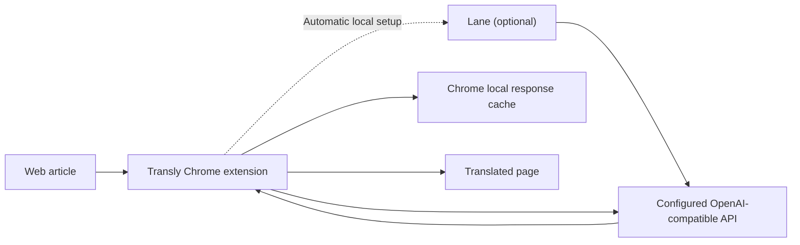

<div align="center">
  
  <h1>Transly</h1>
  <p><strong>Context-aware AI translation for Chrome.</strong></p>

  <p>
    <a href="LICENSE"></a>
    <a href="PRIVACY.md"></a>
    
    
  </p>
</div>

Transly is an open-source Chrome extension for translating web articles with an OpenAI-compatible model service you choose. It reads articles as documents instead of sending isolated fragments, which gives the model more context for terminology, tone, and meaning.

## Why Transly

- **Document-level context.** Paragraph batches share article context for more coherent long-form translation.
- **Built for reading.** Translations appear inside the original page with links, lists, tables, code, formulas, and layout preserved.
- **Progress without flicker.** Complete translated paragraphs appear as soon as each model batch returns.
- **Two reading modes.** Switch between bilingual comparison and translation-only reading; click a translation to reveal its original.
- **Bring your own model service.** Connect Lane automatically, or use any hosted API, self-hosted gateway, or local proxy that exposes a compatible endpoint.
- **Local extension storage.** Provider settings and validated translations stay in Chrome's local extension storage.

Article translation is the primary product. Video subtitle translation is available as an early beta. PDF, EPUB, OCR, image translation, and input-box translation are not supported.

## Install From Source

### With an agent

Give this instruction to an agent with terminal access:

```text
Install the Transly Chrome extension from https://github.com/1MoreBuild/transly.
Use the current checkout if it is Transly; otherwise clone it into a `transly`
folder in the current workspace without asking me for a path. Read AGENTS.md,
run the test suite, and do not make product changes during installation.

When ready, give me the exact repository root to select in Chrome. Tell me to
open chrome://extensions, enable Developer mode, choose Load unpacked, and select
that folder. Then tell me to open Transly's Configure page and enter my API URL,
API key when required, and model. Do not send a real model request without asking first.
```

### Manually

```bash
git clone https://github.com/1MoreBuild/transly.git
```

Open `chrome://extensions`, enable **Developer mode**, choose **Load unpacked**, and select the cloned `transly` folder.

Open Transly. If [Lane](https://github.com/1MoreBuild/Lane) is installed and has
a provider, Transly connects to it automatically. Otherwise choose
**Configure** to search for another local service or enter a hosted API URL and
key. Transly loads the service's available model names into a dropdown so you do
not need to guess a model ID.

See [Provider Setup](docs/providers.md) for compatible endpoint formats, examples, and security guidance.

## Translation Providers

Transly calls an OpenAI-compatible endpoint. It does not bundle a model, sell
model access, or implement provider authentication. Lane is an optional
companion for automatic local provider setup; manual API configuration remains
fully supported.

Your provider can be:

- [Lane](https://github.com/1MoreBuild/Lane), connected automatically through
  Chrome Native Messaging;
- a hosted model API;
- a self-hosted OpenAI-compatible service;
- an API gateway or local proxy, such as [CLIProxyAPI](https://github.com/router-for-me/CLIProxyAPI).

CLIProxyAPI is one optional integration, not a Transly dependency. Provider availability, pricing, authentication, rate limits, data handling, and reliability remain the provider's responsibility.

Lane connection uses Chrome Native Messaging and does not scan ports. Discovery
for other local services runs only when you click **Find other local services**.
It checks a small fixed set of loopback addresses, sends no stored API key, and
does not scan the network.

## Transly And Immersive Translate

[Immersive Translate](https://immersivetranslate.com/) is the closest product reference for Transly and informed much of its bilingual reading experience. The two products currently make different tradeoffs:

| | Transly | Immersive Translate |
| --- | --- | --- |
| Primary focus | High-context article translation | Translation across many formats and platforms |
| Model access | User-configured OpenAI-compatible endpoint | Built-in and custom translation services |
| Article strategy | Larger context shared across model batches | Mature progressive translation pipeline |
| Scope | Articles; video subtitles in beta | Websites, PDFs, EPUBs, images, subtitles, input boxes, and more |
| Maturity | Early-stage open source | Mature cross-platform product |

Transly's larger-context approach is designed to improve terminology, tone, and long-form coherence. Translation quality still depends on the configured model and has not yet been measured in a published benchmark.

## How It Works


```mermaid
flowchart LR
  Page["Web article"] --> Extension["Transly Chrome extension"]
  Extension -. "Automatic local setup" .-> Lane["Lane (optional)"]
  Lane --> Provider
  Extension --> Provider["Configured OpenAI-compatible API"]
  Provider --> Extension
  Extension --> Cache["Chrome local response cache"]
  Extension --> Result["Translated page"]
```

The extension service worker sends extracted text directly to the configured API. API keys are stored in `chrome.storage.local`, are not exposed to webpage scripts, and are not synced through Chrome Sync. Validated translations are cached locally for 30 days.

Read [Architecture](docs/architecture.md) for the request flow and trust boundaries.

## Development

Node.js 20 or newer is only needed for development commands:

```bash
npm test
npm run package
git diff --check
```

The test suite does not send model requests. Reload Transly from `chrome://extensions` after source changes. `npm run package` creates a clean Chrome Web Store archive under `dist/`.

The source manifest uses the verified Chrome Web Store public key, so unpacked
builds use the production extension ID `mdjfkiddlpdgchddcckhcmdjekmmhcgp`.
Lane's fixed Transly allowlist must include that ID before either production
build is released. Do not replace the fixed allowlist with a wildcard. See Chrome's
[manifest key documentation](https://developer.chrome.com/docs/extensions/reference/manifest/key).

Chrome Web Store listing copy, privacy declarations, asset requirements, and
the automated release setup are documented in
[Chrome Web Store Release](docs/chrome-web-store.md).

## Credits

Transly owes a substantial design debt to [Immersive Translate](https://immersivetranslate.com/). Its bilingual reading model, DOM-aware extraction, placeholder protection, style preservation, site compatibility work, and subtitle support informed many product and engineering decisions.

Transly is an independent implementation and is not affiliated with or endorsed by Immersive Translate. Its production extension does not import Immersive Translate code, assets, services, or branding.

## License

[MIT](LICENSE)
