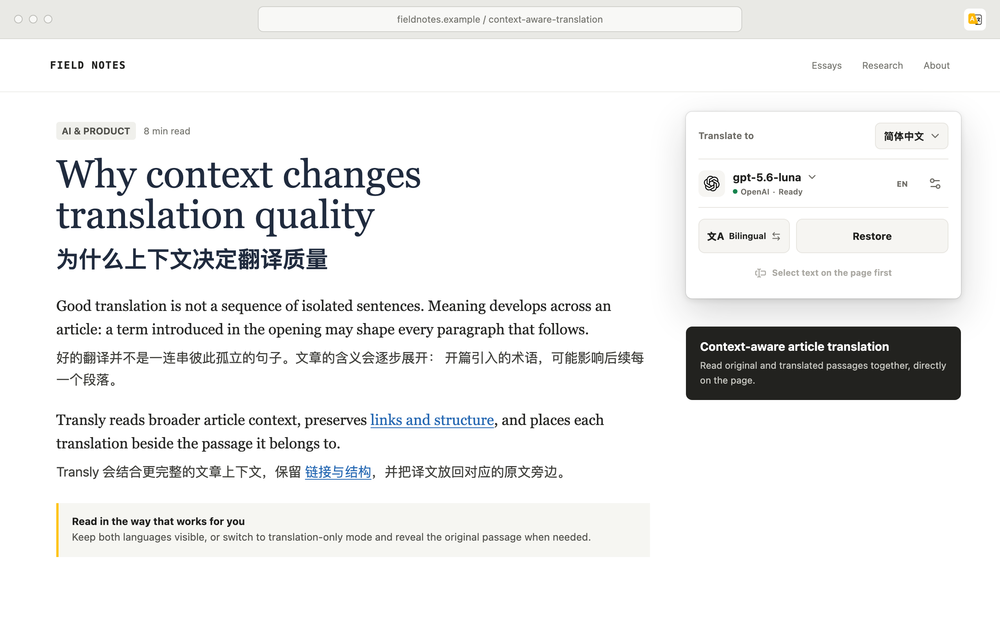

<div align="center">
  
  <h1>Transly</h1>
  <p><strong>Read web articles in your language, without losing their context.</strong></p>

  <p>
    <a href="LICENSE"></a>
    <a href="PRIVACY.md"></a>
    <a href="https://github.com/1MoreBuild/transly/actions/workflows/ci.yml"></a>
    
    
  </p>
</div>

<p align="center">
  
</p>

Transly is an open-source Chrome extension for high-quality article
translation. It gives the model broader document context instead of translating
isolated fragments, then places each translation back into the original page.

## Why Transly

- Shares broader article context with the model for more consistent terminology
  and tone.
- Preserves links, lists, tables, code, formulas, and page hierarchy.
- Shows complete translated passages as each model batch finishes.
- Supports bilingual and translation-only reading modes.
- Works with the OpenAI-compatible model service you choose.

## Get Started

### 1. Install The Extension

```bash
git clone https://github.com/1MoreBuild/transly.git
```

Open `chrome://extensions`, enable **Developer mode**, choose **Load unpacked**,
and select the cloned `transly` folder.

<details>
<summary><strong>Install with a coding agent</strong></summary>

Give this instruction to an agent with terminal access:

```text
Install the Transly Chrome extension from https://github.com/1MoreBuild/transly.
Use the current checkout if it is Transly; otherwise clone it into a `transly`
folder in the current workspace without asking me for a path. Read AGENTS.md,
run the test suite, and do not make product changes during installation.

When ready, give me the exact repository root to select in Chrome. Tell me to
open chrome://extensions, enable Developer mode, choose Load unpacked, and select
that folder. Do not send a real model request without asking first.
```

</details>

### 2. Connect A Model

**Have a ChatGPT/Codex subscription?** Install
[Lane](https://github.com/1MoreBuild/Lane) and sign in with ChatGPT. Transly
detects Lane automatically and loads its available models.

**Have an API endpoint?** Open **Configure** and enter any compatible API URL
and key. Transly supports hosted APIs, self-hosted services, and local proxies
such as [CLIProxyAPI](https://github.com/router-for-me/CLIProxyAPI).

See [Provider Setup](docs/providers.md) for details.

## Product Scope

Article translation is the primary product. Video subtitle translation is an
early beta. PDF, EPUB, OCR, image translation, and input-box translation are not
supported.

## Transly And Immersive Translate

[Immersive Translate](https://immersivetranslate.com/) is the closest product
reference for Transly. The two products make different tradeoffs:

| | Transly | Immersive Translate |
| --- | --- | --- |
| Primary focus | High-context article translation | Translation across many formats and platforms |
| Model access | User-configured OpenAI-compatible endpoint | Built-in and custom translation services |
| Scope | Articles; video subtitles in beta | Websites, PDFs, EPUBs, images, subtitles, input boxes, and more |

Transly's larger-context approach is designed to improve terminology, tone, and
long-form coherence. Translation quality still depends on the configured model
and has not yet been measured in a published benchmark.

## Development

Requires Node.js 20 or newer:

```bash
npm install
npx playwright install chromium
npm test
npm run package
```

`npm test` runs focused unit coverage and product-level Playwright E2E against
the real unpacked extension. The E2E suite uses a local deterministic model
service; it does not send real model requests. More documentation:

- [Provider setup](docs/providers.md)
- [Architecture](docs/architecture.md)
- [Chrome Web Store release](docs/chrome-web-store.md)

## Credits

Transly owes a substantial design debt to
[Immersive Translate](https://immersivetranslate.com/). Its bilingual reading
experience and DOM-aware translation approach informed many product and
engineering decisions.

Transly is an independent implementation and is not affiliated with or endorsed
by Immersive Translate.

## License

[MIT](LICENSE)
