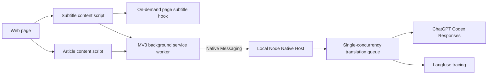

# Architecture

## Components



## Security Boundary

- There is no localhost HTTP listener or CORS surface.
- Only the background service worker can call `chrome.runtime.connectNative()`.
- The Native Host manifest allows one fixed extension origin.
- The Host verifies Chrome's caller-origin argument again at startup.
- Content-script payloads are validated by both the service worker and Native Host.
- OAuth credentials stay inside the Native Host process.
- Native Host stdout is reserved for framed protocol messages; diagnostics use stderr.

## Native Protocol

Chrome Native Messaging uses a four-byte native-endian payload length followed by UTF-8 JSON.

Request:

```json
{
  "protocolVersion": 1,
  "id": "request-uuid",
  "type": "translate",
  "payload": {}
}
```

Success:

```json
{
  "protocolVersion": 1,
  "id": "request-uuid",
  "ok": true,
  "data": {}
}
```

Failure:

```json
{
  "protocolVersion": 1,
  "id": "request-uuid",
  "ok": false,
  "error": {
    "code": "NATIVE_HOST_ERROR",
    "message": "...",
    "retryable": false
  }
}
```

Supported request types are `health`, `translate`, and `audit`. Requests are capped at 2 MB and Host responses at 900 KB.

## Lifecycle

The background worker opens one Native Port for active work. Article batches and the post-translation audit reuse that port and the Host's in-memory cache. Requests are serialized to avoid subscription rate bursts.

When no requests remain, the background worker disconnects after 60 seconds. Chrome closes Host stdin; the Host flushes Langfuse and exits. A later request starts a new Host automatically.

## Translation Strategy

Article translation builds ordered page context, batches by character budget, renders each translated block after its source block, and runs an AI coverage audit.

Subtitle translation captures a complete subtitle resource when possible, parses timed cues, supplies a larger video-level context, and renders the active bilingual cue against `video.currentTime`.

## Provider

The provider reads `~/.codex/auth.json` and `~/.codex/models_cache.json`. The model catalog determines Responses Lite and reasoning settings for GPT-5.6-Luna. Token refresh is singleflight, checks for external Codex updates before writing, and replaces auth state atomically.

The direct ChatGPT Codex Responses backend is an internal compatibility boundary, not a public stable API. Provider-specific code remains isolated under `bridge/` so it can later be replaced by Codex app-server or another supported provider.
