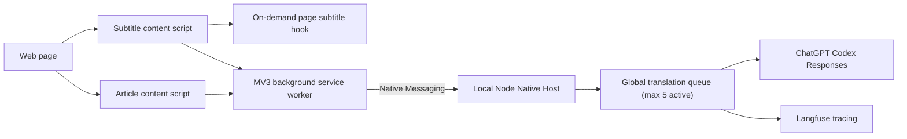

# Architecture

## Components



## Security Boundary

- There is no localhost HTTP listener or CORS surface.
- Only the background service worker can call `chrome.runtime.connectNative()`.
- The Native Host manifest allows one fixed extension origin.
- The Host verifies Chrome's caller-origin argument again at startup.
- Content-script payloads are validated by both the service worker and Native Host.
- OAuth credentials stay inside the Native Host process.
- Native Host stdout is reserved for framed protocol messages. Redacted JSONL diagnostics are written to `~/Library/Logs/Transly/native-host.jsonl`; process and SDK errors use `native-host-stderr.log`.

## Native Protocol

Chrome Native Messaging uses a four-byte native-endian payload length followed by UTF-8 JSON.

Request:

```json
{
  "protocolVersion": 1,
  "id": "request-uuid",
  "type": "translate",
  "payload": {}
}
```

Success:

```json
{
  "protocolVersion": 1,
  "id": "request-uuid",
  "ok": true,
  "data": {}
}
```

While a translation is running, the Host may emit one or more progress frames with the same request ID. Each frame contains only completed translation items; the final success frame still contains the validated full response.

```json
{
  "protocolVersion": 1,
  "id": "request-uuid",
  "ok": true,
  "progress": true,
  "data": {
    "type": "translation-items",
    "items": []
  }
}
```

Failure:

```json
{
  "protocolVersion": 1,
  "id": "request-uuid",
  "ok": false,
  "error": {
    "code": "NATIVE_HOST_ERROR",
    "message": "...",
    "retryable": false
  }
}
```

Supported request types are `health`, `translate`, and `audit`. Requests are capped at 2 MB and Host responses at 900 KB.

## Lifecycle

Article content scripts run in every frame, but the popup sends an article command to only one frame. It ranks frames using visible body text, semantic article text, active translation state, and existing translations. This lets explicitly triggered iframe articles work without translating every ad or widget frame.

The background worker opens one Native Port for active work. Article batches and the post-translation audit reuse that port and the Host's memory hot cache. Successful translation and audit responses are also stored under `~/Library/Caches/Transly/responses/`, so later Host processes can reuse them. Cache identities include the effective model, reasoning setting, instructions, and prompt; changing any model input invalidates the old entry. Files use hashed names and mode `0600`, expire after 30 days, and are bounded to 1,000 entries. Articles are split by character and item budgets without a fixed batch-count cap. The browser submits those batches in viewport-priority order, while the Host is the single concurrency authority: it runs at most five model requests concurrently and queues the rest. Native Messaging output frames are serialized.

When no requests remain, the background worker disconnects after 60 seconds. Chrome closes Host stdin; the Host flushes Langfuse and exits. A later request starts a new Host automatically and can read the persistent response cache.

## Translation Strategy

Article translation builds one ordered page context and splits source blocks by character and item budgets, with no fixed batch-count cap. Every batch receives the same article context. The browser submits every batch in viewport-priority order. As the model completes each JSON string, the Host streams that complete paragraph back to the requesting content frame; the page renders it only after checking its ID and structural placeholders. The validated final batch response remains authoritative, and a failed final response removes streamed results from that batch. If a model response loses structural placeholders, the Host retries only the affected passages once before rejecting the batch. The Native Host is the only concurrency scheduler and runs at most five model requests at once. The AI coverage audit starts after all translation batches settle.

Subtitle translation captures a complete subtitle resource when possible, parses timed cues, splits them by character budget, and submits all batches to the same Native Host scheduler. Each completed batch becomes available to the active bilingual overlay against `video.currentTime`.

## Provider

The provider reads `~/.codex/auth.json` and `~/.codex/models_cache.json`. The model catalog determines Responses Lite and reasoning settings for GPT-5.6-Luna. Token refresh is singleflight, checks for external Codex updates before writing, and replaces auth state atomically.

The direct ChatGPT Codex Responses backend is an internal compatibility boundary, not a public stable API. Provider-specific code remains isolated under `bridge/` so it can later be replaced by Codex app-server or another supported provider.
