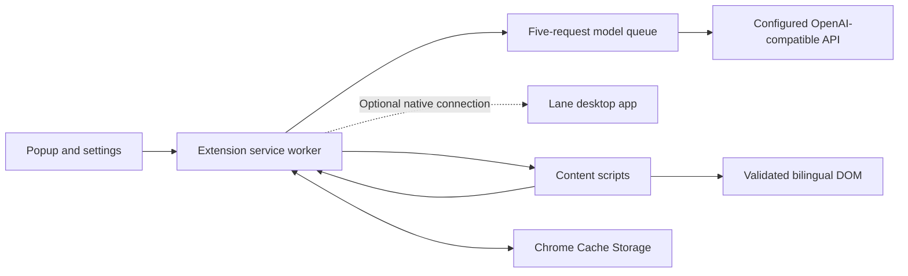

# Architecture

Transly is a Manifest V3 Chrome extension. It can call any configured
OpenAI-compatible API without a companion process. When Lane is installed,
Transly can obtain its local connection automatically through Chrome Native
Messaging.

```mermaid
flowchart LR
  Popup["Popup and settings"] --> BG["Extension service worker"]
  Content["Content scripts"] --> BG
  BG -. "Optional native connection" .-> Lane["Lane desktop app"]
  BG --> Queue["Five-request model queue"]
  Queue --> API["Configured OpenAI-compatible API"]
  BG <--> Cache["Chrome Cache Storage"]
  BG --> Content
  Content --> DOM["Validated bilingual DOM"]
```

## Ownership

The content scripts discover readable blocks, protect page structure with placeholders, order work by viewport priority, and render validated translations.

The service worker owns provider configuration, prompt construction, model request concurrency, streaming JSON parsing, response validation, placeholder repair, the article coverage audit, and the response cache.

The configured provider owns authentication, upstream model access, billing, rate limits, and availability. Transly supports the Responses API and Chat Completions but does not implement or bundle a model proxy.

## Provider Configuration

The user supplies an API URL, model name, optional API key, and optional protocol override. Configuration is stored under `chrome.storage.local`; it is not placed in synchronized storage. Content scripts receive only translation results and a redacted provider status. They never receive the key.

Remote provider URLs must use HTTPS. Plain HTTP is accepted only for `localhost`, `127.0.0.1`, and `::1` so a separately operated local proxy remains possible.

The settings page can discover compatible services on a fixed set of loopback ports. Discovery is started only by an explicit user action, does not enumerate the network, and sends no stored API key. Model names are then read from the selected provider's `/models` endpoint and shown in a native dropdown; manual model entry remains a fallback.

If no provider is configured, the service worker first asks the registered Lane
Native Messaging host for a connection. Chrome and Lane both restrict this path
to Transly's stable extension ID. Lane returns its loopback URL, client key, and
public model IDs; provider OAuth tokens and upstream API keys remain in Lane.

The source manifest uses the verified Chrome Web Store public key so unpacked
builds and Store installs share the same extension ID. Lane must explicitly
allow that production ID; neither side may use a wildcard origin.
Failure is silent and falls back to the normal configuration page. Explicitly
choosing **Connect Lane** can replace an existing provider configuration.

## Translation Flow

1. The content script extracts source blocks and one shared article context.
2. Blocks are divided by character and item budgets, with no fixed batch-count cap.
3. Batches are submitted in viewport-priority order.
4. The service worker allows at most five active model requests. There is no second browser-side scheduler.
5. The model returns a JSON string array. As each complete string becomes parseable, the service worker relays that paragraph to the requesting frame.
6. The content script checks the item ID and structural placeholders before rendering it.
7. The final response is parsed and validated as the authoritative batch result. Missing or duplicated placeholders trigger one compact repair request for affected passages only.
8. After all translation batches settle, the optional AI coverage audit identifies visible article blocks that may still need repair.

Subtitle translation uses the same request queue and validation path with subtitle-specific instructions.

## Cache

Validated translation and audit results are cached in Chrome Cache Storage for 30 days. The cache identity includes the configured provider URL, protocol, model, client content key, and effective prompt. API keys are never included. An in-memory map deduplicates identical requests while the service worker remains alive.

## Trust Boundary

Page scripts cannot access extension local storage or call the provider directly. The API key is attached only by the service worker as a Bearer token. The provider necessarily receives the text being translated, so users should configure only services they trust.

No model generation request is sent until the user starts translation. Configuration and discovery may send metadata-only `/models` requests to an endpoint explicitly entered or selected by the user.
